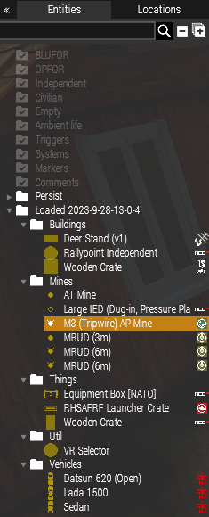
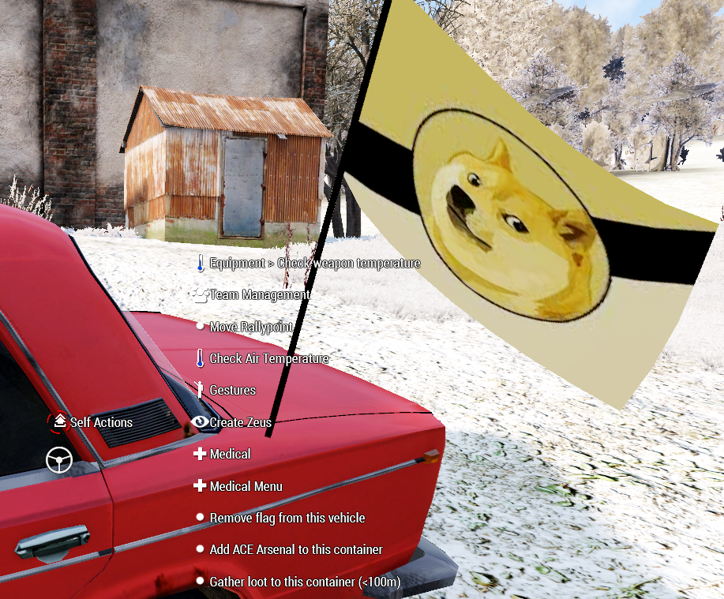

# Zdo's Arma 3 Persistent Campaign scripts

## What is this?

These are scripts that I use in Arma 3 missions to make them feel **persistent**.

Basically, the **effects from previous mission are moved to the next mission**. By effects I mean:

- vehicles (positions, damage, inventory, fuel, textures, flags)
- crates (positions, damage, inventory, arsenal)
- planted mines (positions)
- players (positions, loadout)
- all map markers
- ACE rallypoint position
- ACE trenches, ACE Fortify statics, any buildings placed by Zeus (technically, almost any static which are considered "Things" in Arma)

## Flow

This is how it is supposed to be used:

- create a new mission in 3den however you want
- place the whole directory near `mission.sqm`
    - if you have files to replace like `initPlayerLocal.sqf` and others - manually merge the content instead.
- that's it, the mission is ready to run
- when mission is over and you want to "record the effects" - in the debug console execute

    ```
	private _r = [] call ZDO_fnc_saveForEden;
	profileNamespace setVariable ["zdo_mission", str _r];
	_r;
    ```

- in debug console you should see the content like

    ```
    [["objects",[[["kind","th"],["type","Land_WoodenCrate_01_F"],["pos"<...>
    ```
    
- go to 3den, open the mission file, open debug console and load the saved data by executing

    ```
    private _s = profileNamespace getVariable ["zdo_mission", ""];
	if (!(_s isEqualTo "")) then {
		private _v = parseSimpleArray _s;
		[_v] call ZDO_fnc_loadToEden;
		_v;
	};
    ```

- close debug console and you should get a new layer named `Loaded <date when save was made>`
- this layer contains all saved data split into sublayers:

    

## Why scripts, not a mod?

Developing scripts feels faster, it makes the development easier.

Maybe, someday it will become a mod. For that, there are some configurations that I need but may not be needed by somebody else - these configurations need to be cleaned up.

# Other features

## How inventory is saved

Player can have a backpack with an rifle with plenty of attachments. 

When player puts this backpack to the inventory - nothing changes, backpack with all its items is in there. But when the inventory is being saved, all nesting is removed.

Basically, instead of having a tree

```
backpack
    rifle
        scope
        silencer
```

this is what is beingsaved:

```
backpack
rifle
scope
silencer
```

If player wants to get his loadout back - they would need to repack everything manually. This is not a good option.

Therefore, there is a way to make this container "an arsenal".

## Make crate an arsenal

When admin is looking at a crate, in ACE Self-Interact menu there will be an option to make this crate an arsenal. When you do that:

- this crate gets an ACE Interact option to open an ACE Arsenal
- ACE Arsenal is bound to the crate's content (if there is at least one item of any type - it will appear in the Arsenal)
- the fact that this crate is an arsenal is saved

When player is looking at this crate, there is an option to load items from nearest vehicles to the arsenal.

Why I decided to implement this arsenal?

- using just inventory is not so visually stimulating for players, arsenal is better in this regard
- using unlimited arsenal has too many options (especially, if you are using 3CB Factions)
- using limited arsenal (like the one in Antistasi) implies grind which can make game boring. Hey, you got 10 AKs, but you've died 10 times assaulting the outpost, now go get 10 more AKs. Nah, boring.

By the way, same effect can be achieved by looking at a crate and executing

```
[cursorTarget] call ZDO_fnc_makeArsenalGlobal;
```

## Flag

`flag.jpg` in the mission folder will be automatically assigned to ACE Rallypoint (for independent faction).

While looking at a vehicle, player can select ACE Self-Interact option to put flag on a vehicle as well.


## Looting to a vehicle

While looking at a vehicle, player can choose to gather loot to it.



Why I decided to implement it?

- using one-time use loot crates from Antistasi is too grindy for me
- I want looting to be fun, when you finally did whatever you want and now yeah you get the good loot.
  Running around with loot box is just more tedious.

## Wishbox

Say, it is a time to assault a heavely protected enemy outpost. As the result of this assault, you and your players likely want to get more advanced loot that they do not currently have. What are the options?

*Option A:* Zeus can just give a better loot when next mission is started.

Viable, but immersion breaking. Players get more dophamine when they know that they will actually get the loot as the result of the operation.

*Option B:* Zeus can spawn a crate and put there whatever players say they want.

If you have more than two people playing - it becomes tedious, Zeus becomes a bottleneck.

*Option C:* Just loot whatever will be on the outpost.

Yeah, kind of Antistasi way. But if this is your third outpost - the loot will be pretty much the same as for previous two ones.

*Option D:* The way I see this:

- Zeus spawns a crate (wishbox)
- Players temporarily get full ACE Arsenal
- They select the gear that they want to see in the outpost
    - Zeus may verbally impose some limitations
- When they are done with it, they original loadout is restored
- And whatever they have selected in ACE Arsenal gets added to the crate
- Zeus potentially adds something cool to it
- Zeus moves crate to the enemy base.

Here is how you do it:

- create an empty crate
- make it a "wishbox"
    
    ```
    [cursorTarget] call ZDO_fnc_makeWishboxGlobal;
    ```
    
- call your players to "make a wish" on this container
- when player ACE-interact with the container, there will be a corresponding option which opens full ACE Arsenal
- when player closes arsenal, the chosen gear is put in the wishbox.

# Contributing

Contributions are welcome.

You are allowed to use these scripts and distribute them in your own missions. The only requirement is to mentioned the link to this repository.


- all vehicles
    - inventories (items in nested containers are put in the root container)
    - colors
    - damage
    - flag (use ACE Self-Interact to set flag)
- all inventory objects (crates, supply boxes, etc)
    - inventories (items in nested containers are put in the root container)
    - damage
- statics (sandbags, ACE trenches, ACE Fortify)
- players
    - locations
    - loadouts
- mines
- arsenal
    - synced with actual inventory
- map markers
- wishbox

- flag, rally point
- warlords

Tips:

- delete old layer via right click "Delete" instead of pressing "Delete" button

- Admin tools:

- For save/load in debug panel:

if (is3DEN) then {
	private _s = profileNamespace getVariable ["zdo_mission", ""];
	if (!(_s isEqualTo "")) then {
		private _v = parseSimpleArray _s;
		[_v] call ZDO_fnc_loadToEden;
		_v;
	};
} else {
	private _r = [] call ZDO_fnc_saveForEden;
	profileNamespace setVariable ["zdo_mission", str _r];
	_r;
};


- wishbox

[cursorTarget] call ZDO_fnc_makeWishbox;
